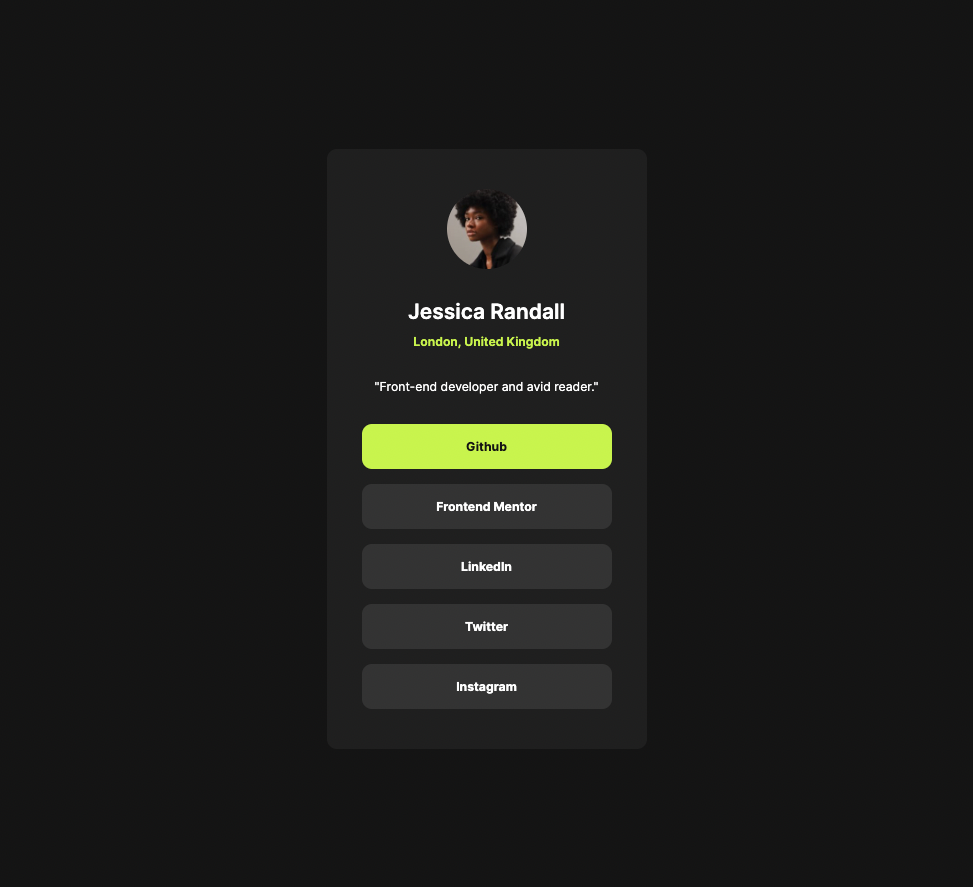

# Frontend Mentor - Social links profile solution

This is a solution to the [Social links profile challenge on Frontend Mentor](https://www.frontendmentor.io/challenges/social-links-profile-UG32l9m6dQ). Frontend Mentor challenges help you improve your coding skills by building realistic projects. 

## Table of contents

- [Overview](#overview)
  - [The challenge](#the-challenge)
  - [Screenshot](#screenshot)
  - [Links](#links)
- [My process](#my-process)
  - [Built with](#built-with)
  - [What I learned](#what-i-learned)
  - [Continued development](#continued-development)
  - [Useful resources](#useful-resources)
- [Author](#author)

## Overview

### The challenge

Users should be able to:

- See hover and focus states for all interactive elements on the page

### Screenshot



### Links

- Live Site URL: [Netlify](ruby-social-links-profile.netlify.app)

## My process

### Built with

- Semantic HTML5 markup
- CSS custom properties
- Flexbox
- Mobile-first workflow

### What I learned

I've learned a bit more about buttons I think. And links. But Iäm still not quite sure when to use which. I also learned a bit more about padding and margin which was needed.

```html
.btn {
    background-color: var(--grey);
    cursor: pointer;
    padding: 15px 20px;
    margin: 15px;
    border: none;
    border-radius: 10px;
    font-weight: 700;
    width: 250px;
}
```

### Continued development

It feels like I'm starting to get the hang of the difference between padding and margin which is nice, but it's definitely something I need to continue practicing and learn more about. I also need to learn more about Flexbox and just keep practicing. I also need to look into the difference between a button and a link and when to use which. 

### Useful resources

- [Mozilla Web Docs](https://developer.mozilla.org/en-US/docs/Web/HTML/Element/button) - This helped me a bit when it comes to the button element, which I decided not to use for the links. I went with anchor tags instead. 

## Author

- Github - [Linda Jensen](https://github.com/lindajensen)
- Frontend Mentor - [@lindajensen](https://www.frontendmentor.io/profile/lindajensen)
- LinkedIn - [Linda Jensen](www.linkedin.com/in/linda-jensen-swe)